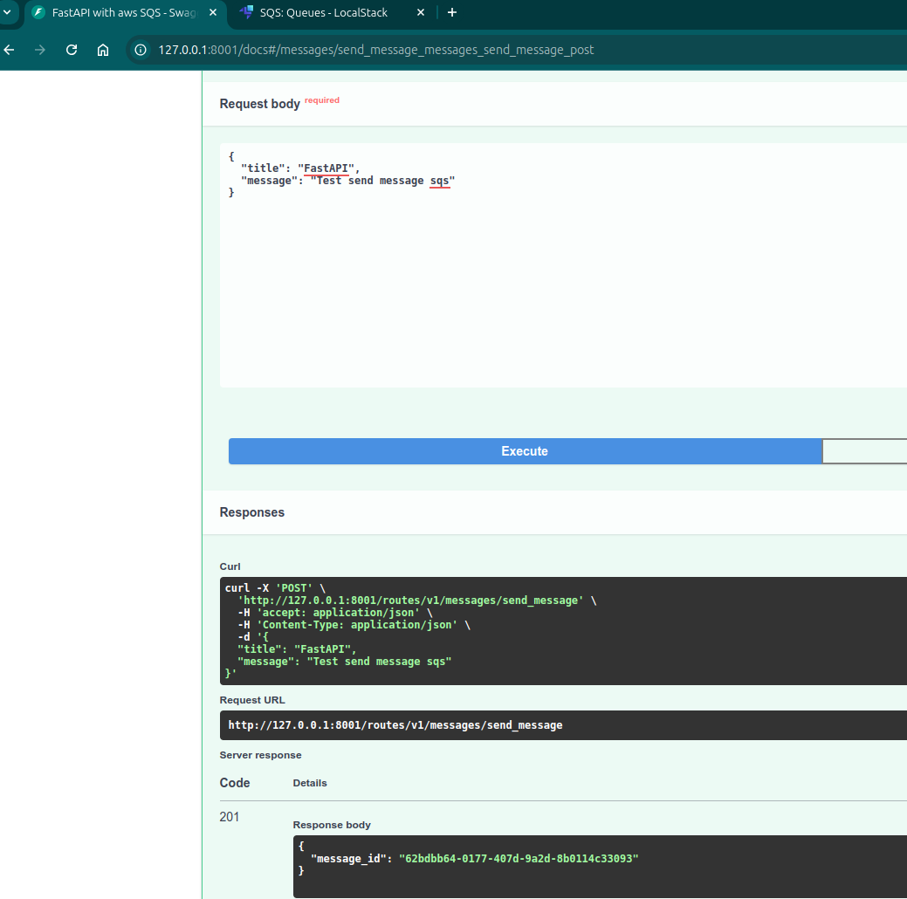
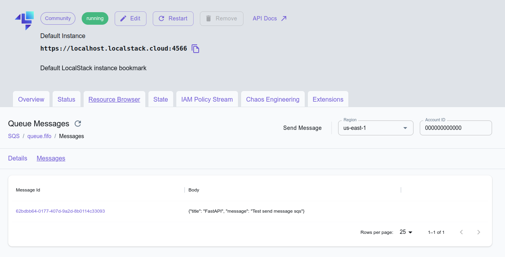
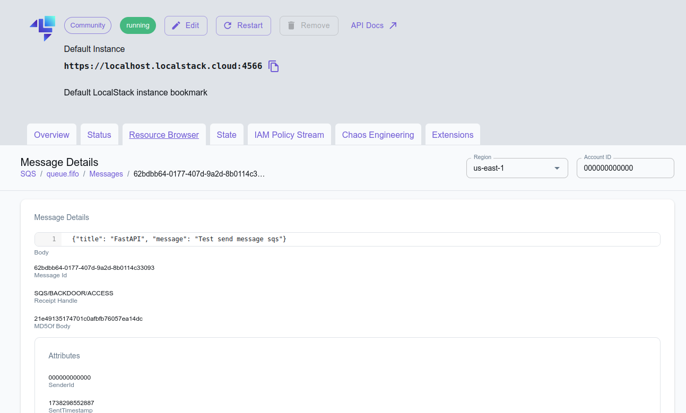
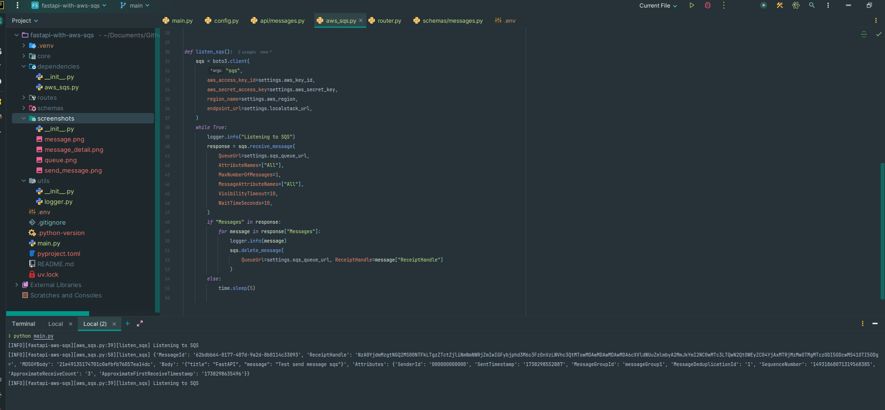

# 📬 FastAPI AWS SQS with LocalStack

🚀 This project demonstrates how to send messages to an **AWS SQS queue** using **FastAPI** and **LocalStack** for local testing.

## 🌟 Why Use AWS SQS?

Amazon Simple Queue Service (SQS) is a fully managed message queuing service that enables decoupling and scaling of microservices, distributed systems, and serverless applications. Some key benefits include:

- **Scalability**: Easily handle high-throughput workloads.
- **Reliability**: Built-in redundancy ensures message durability.
- **Decoupling**: Separates different parts of your application for better maintainability.
- **Security**: Supports encryption and access control via AWS IAM policies.
- **Asynchronous Processing**: Ideal for background tasks and event-driven architectures.

## 📂 Project Structure

```
.
├── .env
├── main.py
├── core
│   └── config.py
├── dependencies
│   └── aws_sqs.py
├── routes
│   └── api
│       └── messages.py
├── schemas
│   └── messages.py
└── utils
    └── logger.py
```

## 🔧 Requirements

- Python **3.8+**
- [uv](https://docs.astral.sh/uv/) (for dependency management)

## 📥 Installation

1️⃣ Clone the repository:

```sh
git clone https://github.com/egoan82/fastapi-with-aws-sqs.git
cd fastapi-with-aws-sqs
```

2️⃣ Create and activate a virtual environment with `uv`:

```sh
uv venv
source .venv/bin/activate
```

3️⃣ Install dependencies:

```sh
pip install -r requirements.txt
```

4️⃣ Configure environment variables in `.env`:

```dotenv
AWS_KEY_ID="test"
AWS_SECRET_KEY="test"
AWS_REGION="us-east-1"
SQS_QUEUE_URL="https://localhost.localstack.cloud:4566/000000000000/queue.fifo"
LOCALSTACK_URL="https://localhost.localstack.cloud:4566"
```

## 🚀 Running the Project

1️⃣ Run the **FastAPI** application:

```sh
uvicorn main:app --reload
```

️2️⃣ Run listener to receive messages:

```sh
python main.py
```

3️⃣ Access the interactive API documentation:

🔗 [Swagger UI](http://127.0.0.1:8000/docs)\
🔗 [ReDoc](http://127.0.0.1:8000/redoc)

## 📤 Sending a Message to SQS

1️⃣ Make a **POST** request to `/send_message` with the following body:

```json
{
  "title": "string",
  "message": "string"
}
```

2️⃣ The API responds with the `message_id` of the sent message.

## 🖼️ Screenshots

Here are some screenshots of the API in action:

### 📌 Swagger UI


### 📌 LoocalStack Dashboard - Queues


### 📌 LoocalStack Dashboard - Messages


### 📌 LoocalStack Dashboard - Message Details


### 📌 Terminal - Message received


## 📚 Resources

- 📌 [FastAPI Documentation](https://fastapi.tiangolo.com/)
- 📌 [LocalStack Documentation](https://docs.localstack.cloud/)
- 📌 [uv - Python Package Manager](https://docs.astral.sh/uv/)

---

🚀 **Happy coding and enjoy building with FastAPI and AWS SQS!** 🎉

